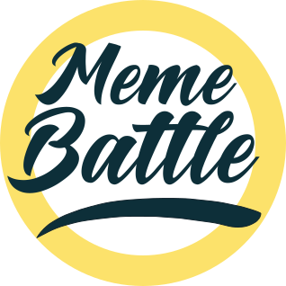

  <h1 align="center">Welcome to MemeBattle!</h1>
  

## What is MemeBattle?
**MemeBattle** is an <b>open community</b> united by common projects.
We are open to new ideas and projects and are happy to invite everyone to join us.

> [!NOTE]
> (Read more in blog)[https://blog.mems.fun/en/posts/what-is-memebattle]

## Projects

### Ligretto

**Ligretto** is fast-paced online multiplayer game in which you need to lay out cards as quickly as possible and outperform your opponents with reaction and agility.

URL: https://ligretto.app

UI-kit: https://ui.ligretto.app/

GitHub project: https://github.com/orgs/MemeBattle/projects/1

[Ligretto documentation](./docs/ligretto.md)

### GameHub

**GameHub** is online games service. Unfortunately, there is only one game so far. But in the ideal future, it will be a portal for multiple online games in one ecosystem.

URL: https://mems.fun

### Blog

Not only news from the MemeBattle team, but also various posts from everyone.
First of all, we would like to share technical discoveries and experiences.

URL: https://blog.mems.fun/

## First steps
1. Read [documentation](./docs)
2. Read [CONTRIBUTING.md](CONTRIBUTING.md) TODO: Create contribution doc [#215](https://github.com/MemeBattle/monorepo/issues/215)
3. Download repository `git clone git@github.com:MemeBattle/monorepo.git`
4. Install dependencies `yarn`
