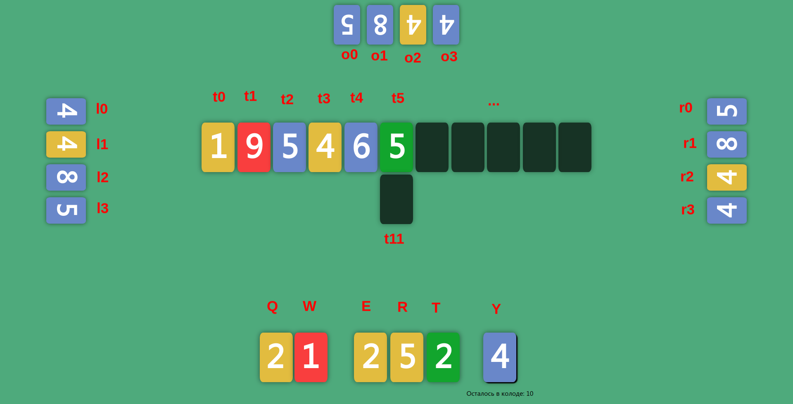

## Docs

Карточки на столе обозначаются как t0-tx, где x ограничивается константой из конфига MAX_CARDS_ON_TABLE

<figure class="video_container">
<iframe width="1920" height="1176" src="https://xd.adobe.com/embed/bb6b3ae6-1a1c-4d9a-719b-21ba0b74f4da-cd5a/" frameborder="0" allowfullscreen="true" mozallowfullscreen="true" webkitallowfullscreen="true"></iframe>
</figure>
